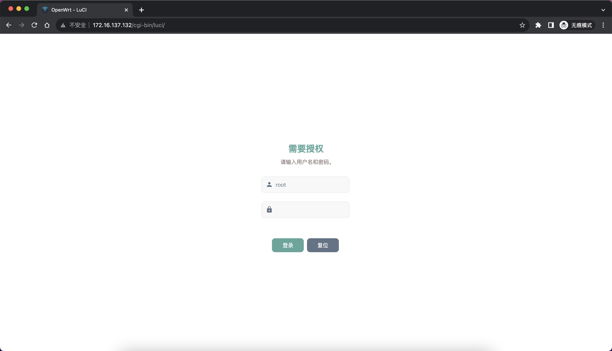
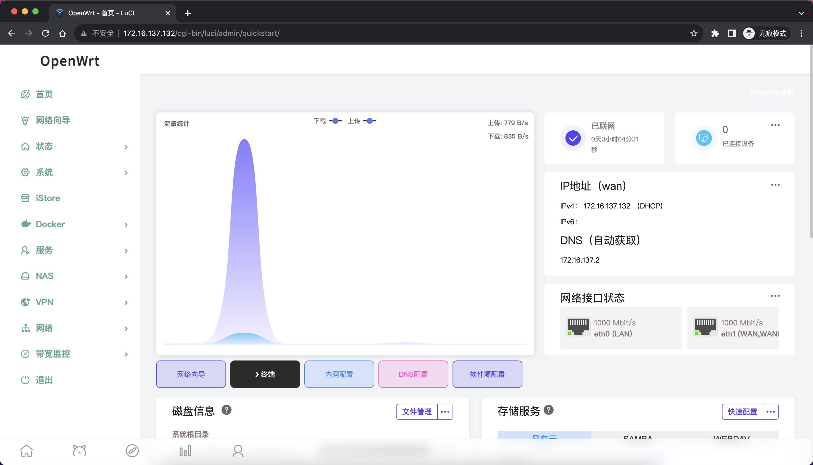
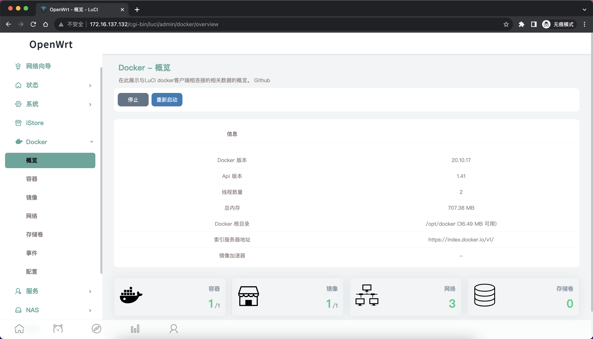

# OpenWRT-CI
云编译OpenWRT固件

LEDE源码：
https://github.com/coolsnowwolf/lede

IMMORTALWRT源码：
https://github.com/immortalwrt/immortalwrt

# 固件简要说明：

固件每天早上4点自动编译。

固件信息里的时间为编译开始的时间，方便核对上游源码提交时间。

X64系列，包含X64、X86，内核保持最新。

Redmi-AX6因无线驱动问题，暂时维持源码版本在20230501，内核版本固定5.10。

固件内置 OpenClash、Wiregaurd、OpenVPN、iStore、QuickStart、DDNS、turboacc、v2ray-server 和其它一些默认组件，去除了我用不到的 smaba、zerotier、ipsec、adbyby-plus、accesscontrol、vsftpd 组件。Docker 组件只内置在 X64 固件中。

默认主题：Design (mode: light)

# 目录简要说明：

Depends.txt——环境依赖列表

workflows——自定义CI配置

Scripts——自定义脚本

Config——自定义配置

  -- General.txt 为通用配置文件，用于设定各平台都用得到的插件。

  -- 其它 txt 为各平台主要配置文件，用于设定机型及额外插件。
